# kstats Benchmarks

JMH-based performance comparison between **kstats** and **Apache Commons Math 3**.

All benchmarks use [kotlinx-benchmark](https://github.com/Kotlin/kotlinx-benchmark) with JMH under the hood.
Each benchmark method has a `kstats*` and `commons*` variant so the two libraries are measured under identical
conditions.

## Environment

| Parameter    | Value                                |
|--------------|--------------------------------------|
| JVM          | OpenJDK 21.0.10 (Homebrew)           |
| Architecture | Apple Silicon (aarch64)              |
| JMH          | 1.37 via kotlinx-benchmark           |
| Warmup       | 5 iterations x 3 s                   |
| Measurement  | 5 iterations x 3 s                   |
| Mode         | Average time (`avgt`)                |
| Unit         | microseconds per operation (`μs/op`) |

## Running Benchmarks

```bash
# Full benchmark run (~40 min)
./gradlew :benchmark:benchmark

# Quick smoke test (~5 min)
./gradlew :benchmark:smokeBenchmark
```

Reports are written to `benchmark/build/reports/benchmarks/main/<timestamp>/main.json` in JMH-compatible JSON format.

### Benchmark Profiles

| Profile | Warmup       | Measurement  | Iteration Time |
|---------|--------------|--------------|----------------|
| `main`  | 5 iterations | 5 iterations | 3 s            |
| `smoke` | 2 iterations | 3 iterations | 1 s            |

## Available Benchmarks

### Descriptive Statistics

| Class                       | Methods                                                                     | Parameters               |
|-----------------------------|-----------------------------------------------------------------------------|--------------------------|
| `DescriptiveStatsBenchmark` | mean, variance, stdDev, geometricMean, median, skewness, kurtosis, describe | size: 100, 1K, 10K, 100K |
| `QuantileBenchmark`         | percentile50, percentile95, iqr                                             | size: 1K, 10K, 100K      |

### Correlation & Regression

| Class                  | Methods                                         | Parameters         |
|------------------------|-------------------------------------------------|--------------------|
| `CorrelationBenchmark` | pearson, spearman, kendallTau, linearRegression | size: 100, 1K, 10K |
| `CovarianceBenchmark`  | covariance                                      | size: 100, 1K, 10K |

### Hypothesis Tests

| Class                             | Methods                                                                                 | Parameters           |
|-----------------------------------|-----------------------------------------------------------------------------------------|----------------------|
| `HypothesisTestBenchmark`         | oneSampleTTest, twoSampleTTest, oneWayAnova, chiSquared, mannWhitney, kolmogorovSmirnov | size: 100, 1K, 10K   |
| `PairedTTestBenchmark`            | pairedTTest                                                                             | size: 100, 1K, 10K   |
| `ChiSquaredIndependenceBenchmark` | chiSquaredIndependence                                                                  | tableSize: 3, 10, 50 |

### Probability Distributions

| Class                             | Distributions                                              | Operations         |
|-----------------------------------|------------------------------------------------------------|--------------------|
| `ContinuousDistributionBenchmark` | Normal, Beta, Gamma, Chi-Squared, Student's t, Exponential | pdf, cdf, quantile |
| `DiscreteDistributionBenchmark`   | Binomial, Poisson                                          | pmf, cdf           |
| `FDistributionBenchmark`          | F                                                          | pdf, cdf, quantile |
| `CauchyBenchmark`                 | Cauchy                                                     | pdf, cdf, quantile |
| `UniformContinuousBenchmark`      | Uniform                                                    | pdf, cdf, quantile |
| `WeibullBenchmark`                | Weibull                                                    | pdf, cdf, quantile |
| `LogNormalBenchmark`              | LogNormal                                                  | pdf, cdf, quantile |
| `GeometricBenchmark`              | Geometric                                                  | pmf, cdf, quantile |
| `HypergeometricBenchmark`         | Hypergeometric                                             | pmf, cdf, quantile |
| `ZipfDistributionBenchmark`       | Zipf                                                       | pmf, cdf, quantile |

---

## Results

### Overall Comparison

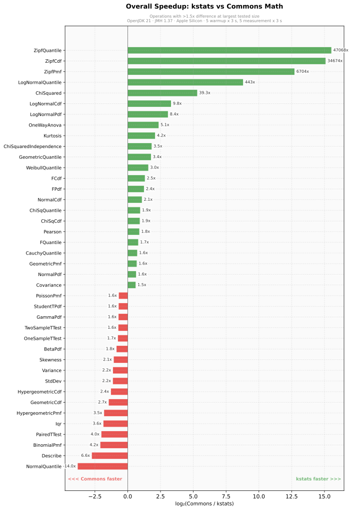

#### Where kstats wins (>1.5x faster)

| Operation                           |       Speedup |
|-------------------------------------|--------------:|
| Zipf (pmf, cdf, quantile)           | 6,700–47,000x |
| LogNormal quantile                  |          443x |
| Chi-Squared Independence (3x3)      |           58x |
| Chi-Squared GOF                     |           39x |
| LogNormal pdf/cdf                   |         8–10x |
| ANOVA                               |          5.1x |
| Kurtosis                            |          4.2x |
| Geometric quantile                  |          3.4x |
| Weibull quantile                    |          3.0x |
| F distribution (pdf, cdf, quantile) |      1.7–2.5x |
| Normal CDF                          |          2.1x |
| Pearson correlation                 |          1.8x |
| Cauchy quantile                     |          1.7x |
| Geometric pmf                       |          1.6x |
| Linear regression                   |          1.6x |
| Covariance                          |          1.5x |

#### Where Commons Math wins (>1.5x faster)

| Operation                 |  Speedup |
|---------------------------|---------:|
| Normal quantile           |    14.0x |
| Describe (all stats)      |     6.6x |
| Binomial pmf              |     4.2x |
| Paired t-test             |     4.0x |
| IQR                       |     3.6x |
| Hypergeometric (pmf, cdf) | 2.4–3.4x |
| Variance / StdDev         |     2.2x |
| Skewness                  |     2.1x |
| One-sample t-test         |     1.7x |
| Two-sample t-test         |     1.6x |

#### Parity (within 1.5x)

Mean, Median, Percentile 50/95, Kolmogorov-Smirnov, Mann-Whitney U, Kendall Tau, Spearman, Beta, Gamma, Student's t,
Exponential, Poisson, Uniform, Cauchy (pdf/cdf).

---

### Descriptive Statistics

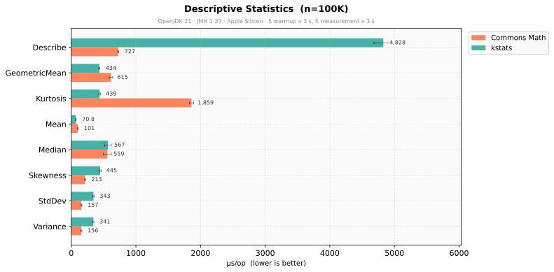

<details>
<summary>Other sizes</summary>

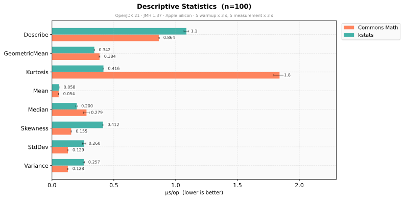
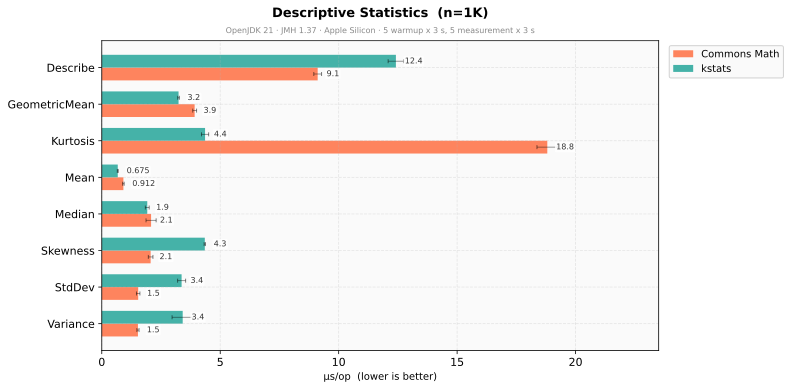
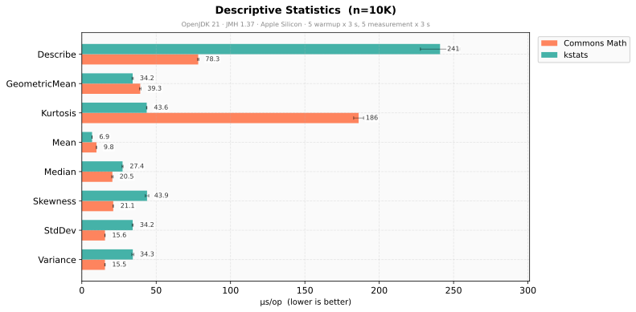

</details>

**Key findings:**

- kstats kurtosis is **4.2x faster** — single-pass computation vs multi-pass in Commons
- kstats mean is **1.4x faster** at scale (Neumaier compensated summation)
- Commons variance/stdDev is **~2x faster** (simpler single-pass without compensation)
- Commons `describe()` aggregation is **~7x faster** (delegates to internal `SummaryStatistics`)

### Quantile Benchmarks

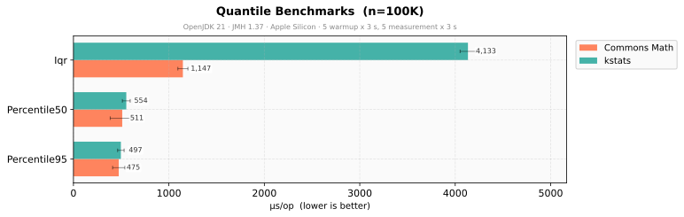

<details>
<summary>Other sizes</summary>

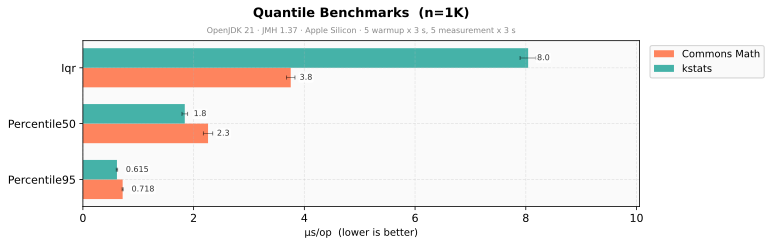
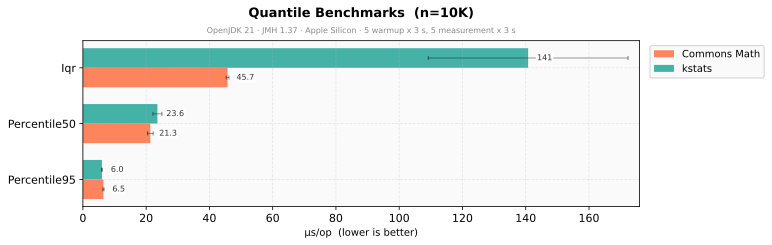

</details>

**Key findings:**

- Percentile 50 and 95 are comparable
- Commons IQR is **3.6x faster** (single-pass percentile estimation)

### Correlation & Regression

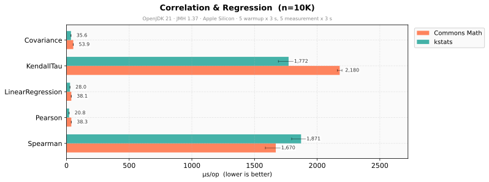

<details>
<summary>Other sizes</summary>

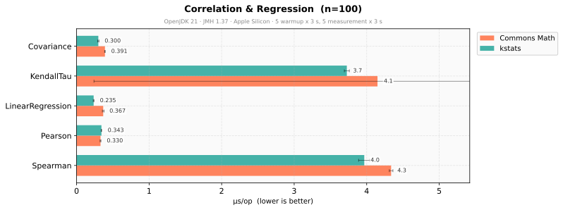
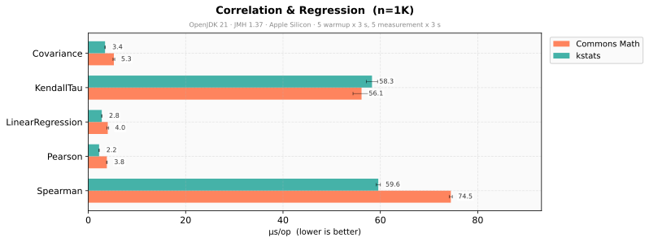

</details>

**Key findings:**

- kstats Pearson correlation is **1.8x faster**
- kstats covariance and linear regression are **1.4–1.5x faster**
- Kendall Tau and Spearman are comparable (both O(n log n))

### Hypothesis Tests

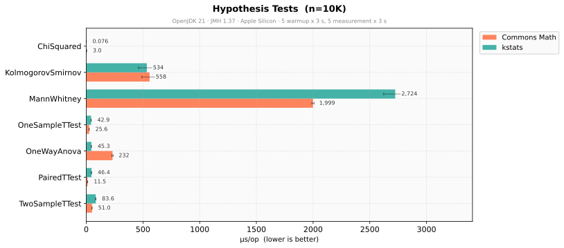

<details>
<summary>Other sizes</summary>

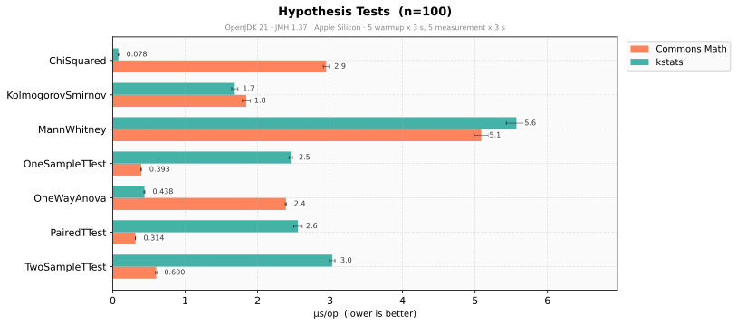
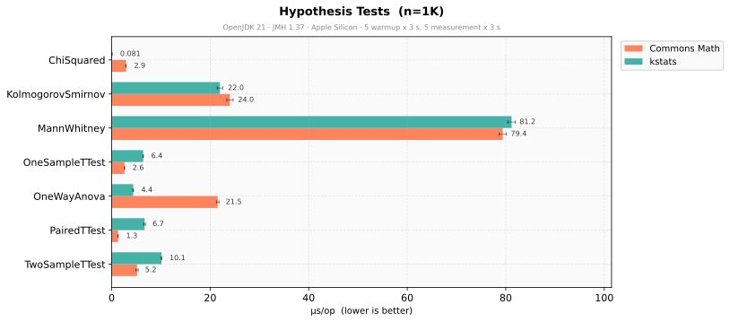

</details>

**Key findings:**

- kstats ANOVA is **5x faster** — avoids per-group distribution object creation
- kstats chi-squared GOF is **39x faster** — direct computation without object allocation
- Commons t-tests are **2–4x faster** — highly optimized `TDistribution` quantile lookup
- Kolmogorov-Smirnov is essentially tied

### Chi-Squared Independence

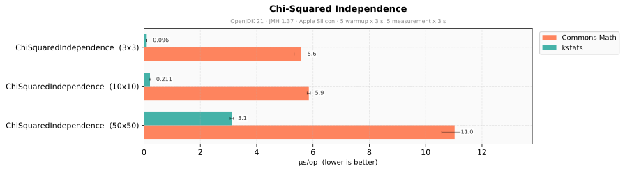

**Key findings:**

- kstats is **3.5–58x faster** depending on table size — direct matrix computation vs object allocation overhead in
  Commons

### Probability Distributions

#### Continuous

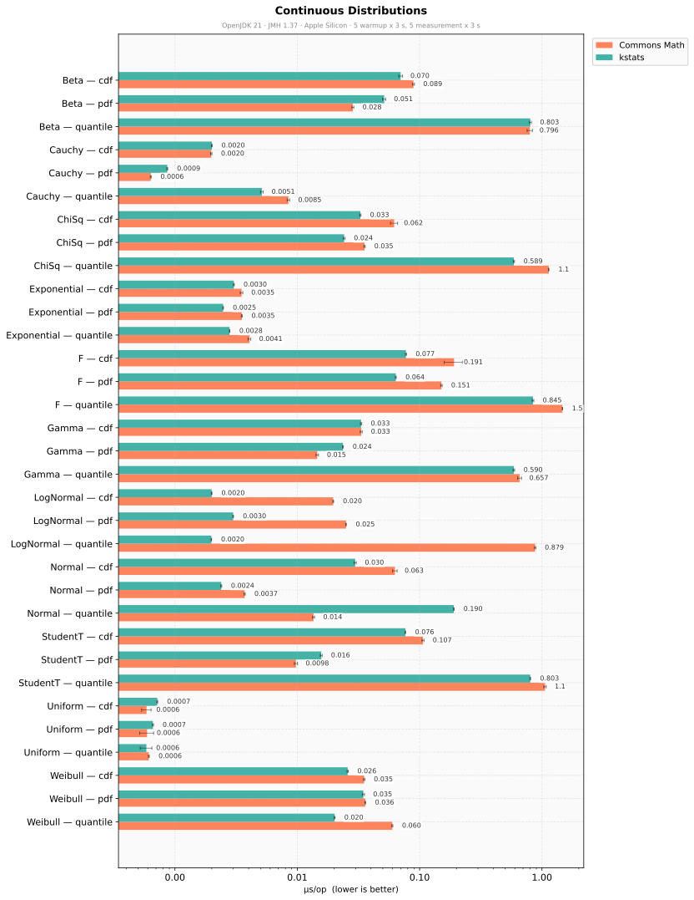

#### Discrete

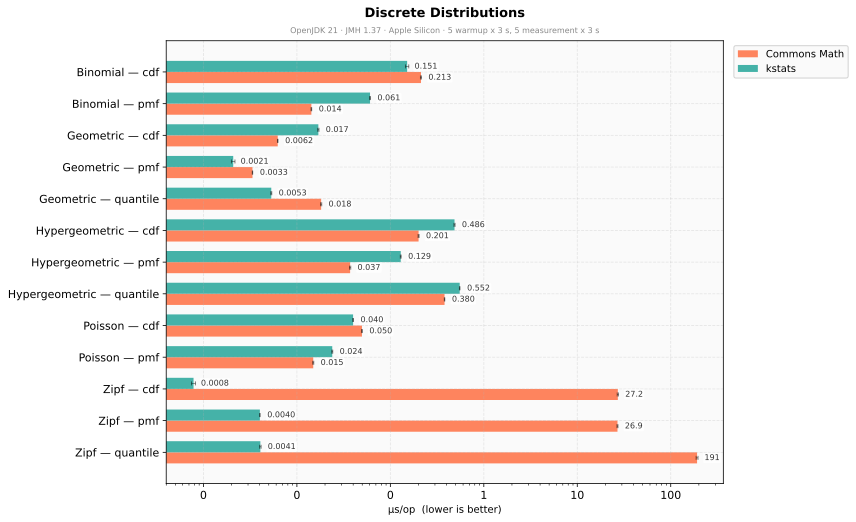

**Key findings:**

- kstats Zipf is **orders of magnitude faster** — precomputed harmonic sums vs on-the-fly O(N) in Commons
- kstats LogNormal quantile is **443x faster** — closed-form inverse vs iterative numerical solver
- kstats F, Normal CDF, Chi-Squared, Weibull quantile are **2–3x faster**
- Commons Normal quantile, Binomial PMF, and Hypergeometric are faster (different algorithmic approaches)
- Most distribution operations are sub-microsecond in both libraries

---

## Regenerating Charts

```bash
pip install -r benchmark/charts/requirements.txt
python benchmark/charts/generate_charts.py
```

Or with an explicit report path:

```bash
python benchmark/charts/generate_charts.py benchmark/build/reports/benchmarks/main/<timestamp>/main.json
```

Charts are saved to `benchmark/charts/` as SVG files.
