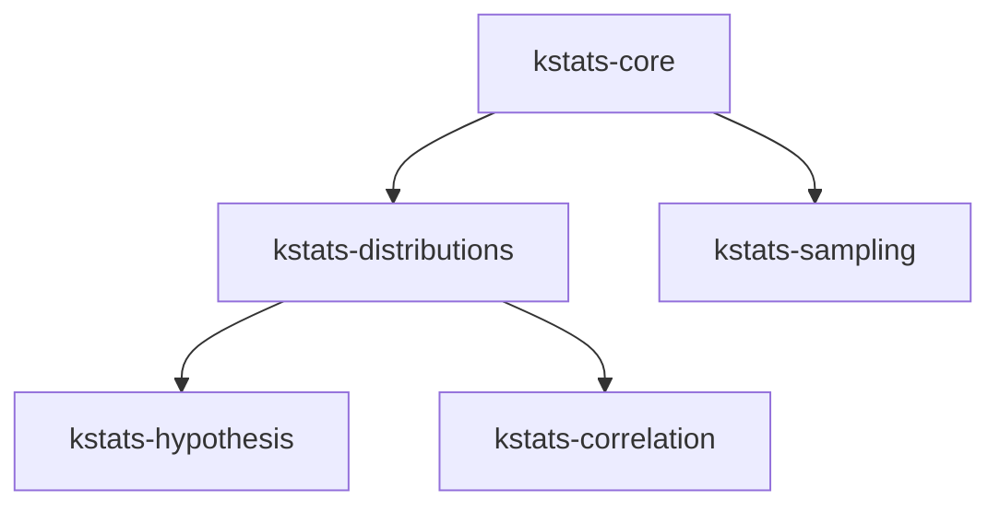

kstats wird unter `org.oremif` auf Maven Central veröffentlicht. Die aktuelle Version ist `{{kstats-version}}`.

## Gradle-KTS-Einrichtung

<Tabs>
  <Tab title="BOM (empfohlen)">
    Die BOM hält alle Module auf derselben Version. Es müssen nur die Module aufgeführt werden, die das Projekt benötigt.

    ```kotlin
    dependencies {
        implementation(platform("org.oremif:kstats-bom:{{kstats-version}}"))

        implementation("org.oremif:kstats-core")
        implementation("org.oremif:kstats-distributions")
        implementation("org.oremif:kstats-hypothesis")
        implementation("org.oremif:kstats-correlation")
        implementation("org.oremif:kstats-sampling")
    }
    ```
  </Tab>
  <Tab title="Einzelnes Modul">
    Für Projekte, die nur ein Modul benötigen, wird die Version direkt angegeben.

    ```kotlin
    dependencies {
        implementation("org.oremif:kstats-core:{{kstats-version}}")
    }
    ```
  </Tab>
  <Tab title="KMP commonMain">
    In einem Kotlin-Multiplatform-Projekt werden Abhängigkeiten innerhalb von `commonMain` deklariert.

    ```kotlin
    kotlin {
        sourceSets {
            commonMain.dependencies {
                implementation(project.dependencies.platform("org.oremif:kstats-bom:{{kstats-version}}"))

                implementation("org.oremif:kstats-core")
                implementation("org.oremif:kstats-distributions")
            }
        }
    }
    ```
  </Tab>
</Tabs>

## Modulübersicht

| Modul | Umfasst | Abhängig von |
| --- | --- | --- |
| `kstats-core` | Deskriptive Statistik, mathematische Hilfsfunktionen, Validierung, Exceptions | — |
| `kstats-distributions` | 18 stetige + 10 diskrete Wahrscheinlichkeitsverteilungen | `kstats-core` |
| `kstats-hypothesis` | Parametrische, nichtparametrische, Normalitäts- und kategoriale Tests | `kstats-distributions` |
| `kstats-correlation` | Korrelationskoeffizienten, Matrizen, einfache lineare Regression | `kstats-distributions` |
| `kstats-sampling` | Rangbildung, Normalisierung, Binning, Bootstrap, gewichtetes Sampling | `kstats-core` |



<Tip>
Beginnen Sie mit `kstats-core` für deskriptive Zusammenfassungen. Fügen Sie `kstats-distributions` hinzu, wenn Wahrscheinlichkeitsmodelle benötigt werden, und `kstats-hypothesis` oder `kstats-correlation`, wenn die Analyse in Richtung Inferenzstatistik geht. Verwenden Sie die BOM, sobald das Projekt von mehr als einem Modul abhängt.
</Tip>

## Nächste Schritte

<CardGroup cols={2}>
  <Card title="Quickstart" icon="play" href="/de/getting-started/quickstart">
    Die erste Analyse mit Beispielen aus allen Modulen durchführen.
  </Card>
  <Card title="Unterstützte Zielplattformen" icon="layers" href="/de/getting-started/introduction#unterstützte-zielplattformen">
    Die vollständige Liste der Kotlin-Multiplatform-Zielplattformen einsehen.
  </Card>
</CardGroup>
