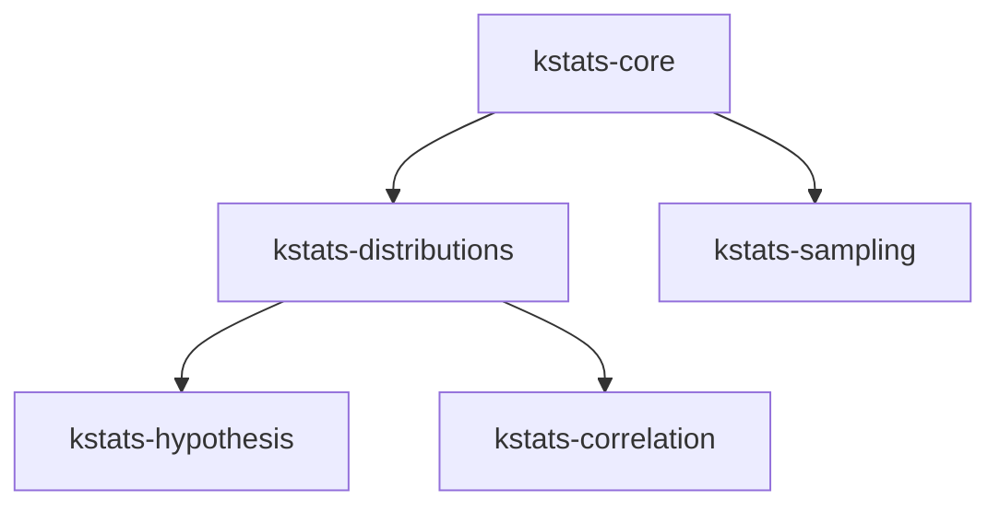

kstats is published to Maven Central under `org.oremif`. The current version is `{{kstats-version}}`.

## Gradle KTS Setup

<Tabs>
  <Tab title="BOM (recommended)">
    The BOM keeps every module aligned to the same version. List only the modules the project needs.

    ```kotlin
    dependencies {
        implementation(platform("org.oremif:kstats-bom:{{kstats-version}}"))

        implementation("org.oremif:kstats-core")
        implementation("org.oremif:kstats-distributions")
        implementation("org.oremif:kstats-hypothesis")
        implementation("org.oremif:kstats-correlation")
        implementation("org.oremif:kstats-sampling")
    }
    ```
  </Tab>
  <Tab title="Single module">
    For projects that need only one module, specify the version directly.

    ```kotlin
    dependencies {
        implementation("org.oremif:kstats-core:{{kstats-version}}")
    }
    ```
  </Tab>
  <Tab title="KMP commonMain">
    In a Kotlin Multiplatform project, declare dependencies inside `commonMain`.

    ```kotlin
    kotlin {
        sourceSets {
            commonMain.dependencies {
                implementation(project.dependencies.platform("org.oremif:kstats-bom:{{kstats-version}}"))

                implementation("org.oremif:kstats-core")
                implementation("org.oremif:kstats-distributions")
            }
        }
    }
    ```
  </Tab>
</Tabs>

## Module Map

| Module | Covers | Depends on |
| --- | --- | --- |
| `kstats-core` | Descriptive statistics, math utilities, validation, exceptions | — |
| `kstats-distributions` | 18 continuous + 10 discrete probability distributions | `kstats-core` |
| `kstats-hypothesis` | Parametric, non-parametric, normality, and categorical tests | `kstats-distributions` |
| `kstats-correlation` | Correlation coefficients, matrices, simple linear regression | `kstats-distributions` |
| `kstats-sampling` | Ranking, normalization, binning, bootstrap, weighted sampling | `kstats-core` |



<Tip>
Start with `kstats-core` for descriptive summaries. Add `kstats-distributions` when probability models are needed, and `kstats-hypothesis` or `kstats-correlation` when the analysis moves into inference. Use the BOM as soon as the project depends on more than one module.
</Tip>

## Next Steps

<CardGroup cols={2}>
  <Card title="Quick Start" icon="play" href="/getting-started/quick-start">
    Run the first analysis with examples across all modules.
  </Card>
  <Card title="Supported Targets" icon="layers" href="/getting-started/introduction#supported-targets">
    See the full list of Kotlin Multiplatform targets.
  </Card>
</CardGroup>
